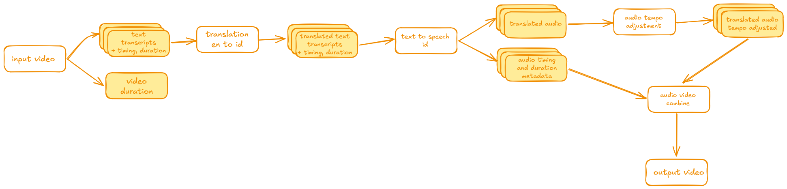

the goal of this app is to perform automated dubbing of english videos to indonesia

pending tasks:
1. get start time and end time for each sentences, add with subtitle format
2. sync start time and end time for each dubbed sentence
3. provide the voice for male and female

plan ERD:
